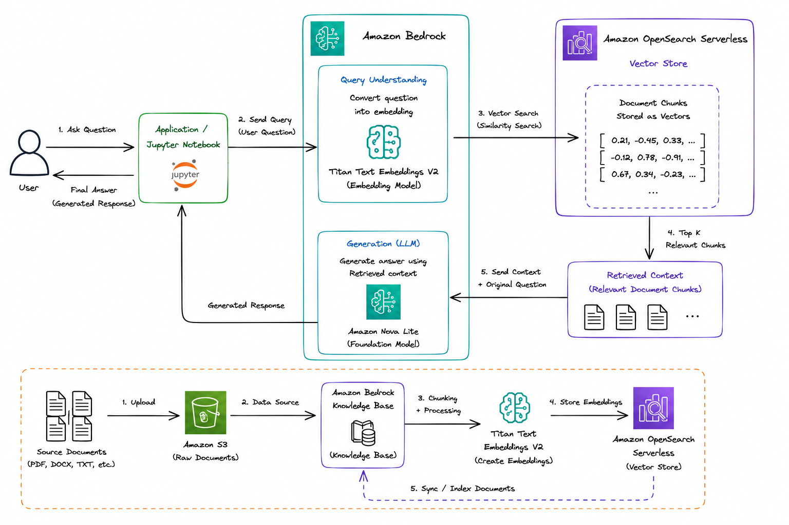

# Retrieval-Augmented Generation (RAG) based-Document-Q&A-System

## RAG Workflow

```
User Question
      ↓
Convert Question into Embedding
      ↓
Vector Search (Amazon OpenSearch)
      ↓
Retrieve Relevant Chunks
      ↓
Send Context + Question to LLM
      ↓
Generate Final Response
```

## Architecture



This project uses the following AWS services:

- **Amazon Bedrock**
  - Foundation Model (Amazon Nova Lite)
  - Titan Text Embeddings V2
  - Knowledge Base
- **Amazon OpenSearch Serverless**
  - Vector database
- **Amazon S3**
  - Stores source documents
- **Python (Boto3 SDK)**
  - Interacts with Bedrock APIs

## Project Implementation Steps

### Step 1: Create an AWS Account

### Step 2: Create an IAM User

Reason:
- Root users should not be used for day-to-day development.
- IAM users provide secure and controlled access to AWS services.

### Step 3: Grant Required Permissions

For this demo, assign:
- `AmazonBedrockFullAccess`
- `AmazonS3FullAccess`
- `AmazonOpenSearchServiceFullAccess`

Optional:
- `IAMFullAccess`
- `CloudWatchLogsFullAccess`

### Step 4: Login Using the IAM User

Do not use the AWS root user for application development.

### Step 5: Create an Amazon Bedrock Knowledge Base

During creation:
- Select Amazon OpenSearch Serverless as the vector store.
- Choose Titan Text Embeddings V2.
- Create a new S3 bucket (or use an existing one).
- Upload the documents.
- Synchronize the data source.

### Step 6: Verify the Knowledge Base

After synchronization:
- Ensure documents are indexed successfully.
- Verify that embeddings have been generated.
- Test retrieval using the Bedrock console.

### Step 7: Build the RAG Application

The implementation consists of four major steps:
1. Connect to Amazon Bedrock.
2. Retrieve relevant document chunks.
3. Pass the retrieved context to Amazon Nova Lite.
4. Generate the final response.

## Python Libraries

We will primarily use:
- `boto3`
- `json`

## Repo Contents

- `RAG-Amazon Bedrock.ipynb` - the main notebook, following the steps above.
- `AMZN-Q1-2026-Earnings-Release.pdf` - sample document used as the knowledge base source.
- `main.py` - placeholder entry point (core logic lives in the notebook).
- `images/` - architecture diagrams referenced above.
- `pyproject.toml` / `uv.lock` - project dependencies, managed with uv (https://github.com/astral-sh/uv).

## Setup

Clone the repo:

```bash
git clone https://github.com/JaiswarRohit/RAG-based-Document-Q-A-System.git
cd RAG-based-Document-Q-A-System
```

Install dependencies with uv:

```bash
uv sync
```

Or with pip:

```bash
pip install boto3 jupyter
```

## Usage

1. Complete Steps 1-6 above so you have a working Knowledge Base.
2. Open the notebook:
   ```bash
   uv run jupyter notebook "RAG-Amazon Bedrock.ipynb"
   ```
3. Replace `"your-kb-id"` in the notebook with your actual Knowledge Base ID.
4. Run the cells in order. The last cell prints the model's generated answer.

## Notes

- This is a learning/demo project, not production code. There's no error handling around missing credentials, empty retrieval results, or rate limits.
- Swap in any other Bedrock-supported model by changing the `model_id` variable.
- To use your own documents instead of the sample PDF, upload them to the S3 bucket backing your Knowledge Base and let it sync/re-index.
